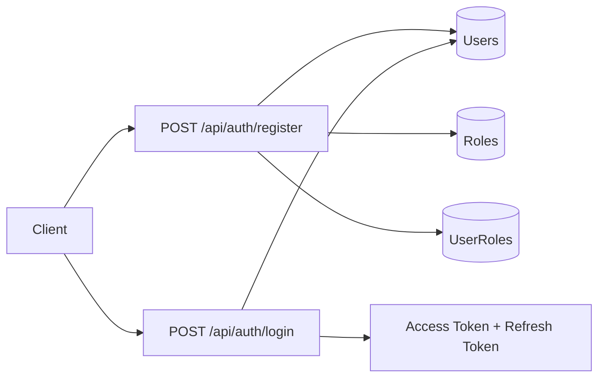
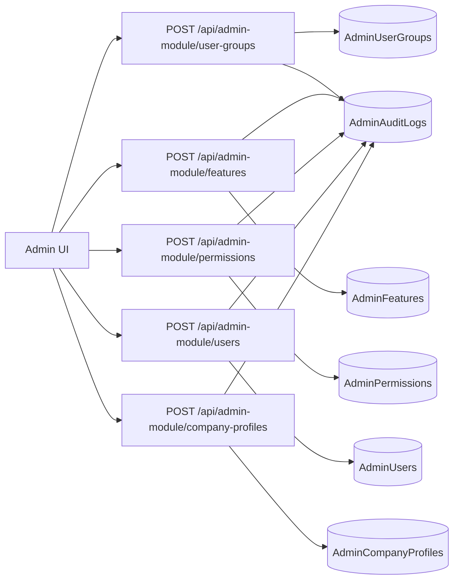
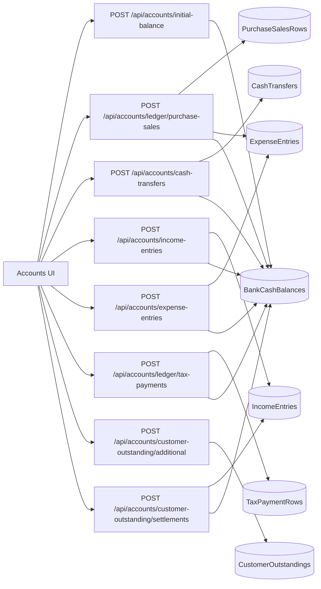
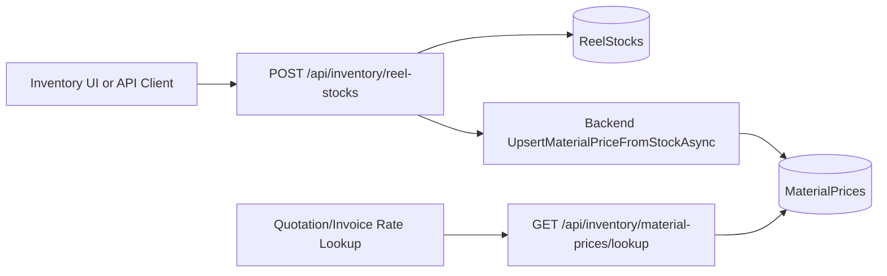
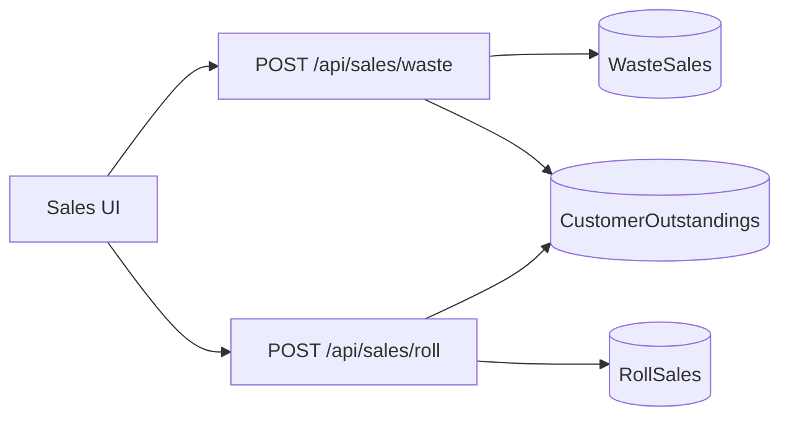
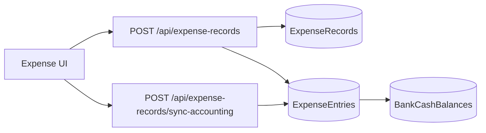
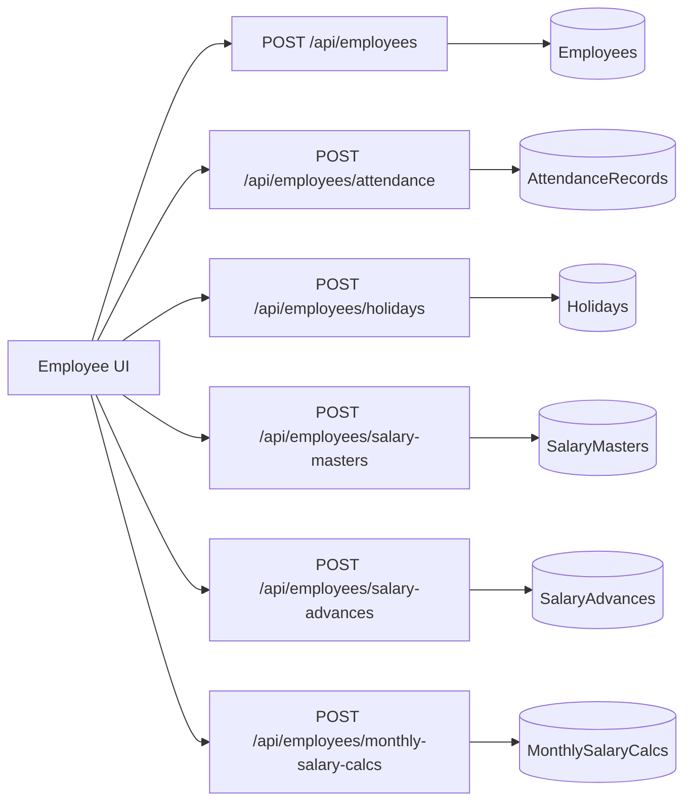
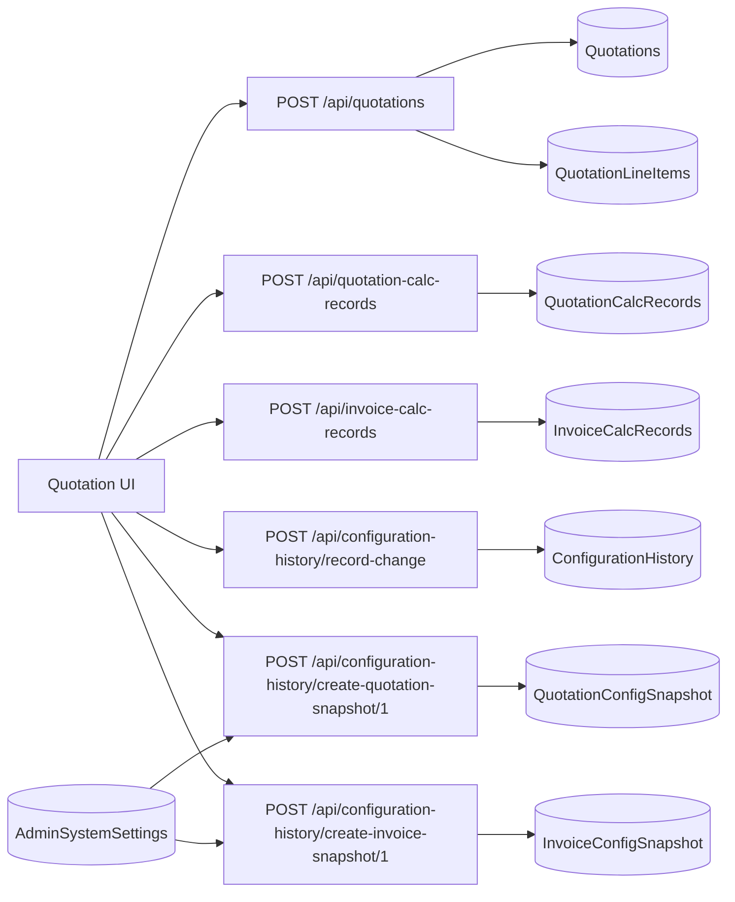
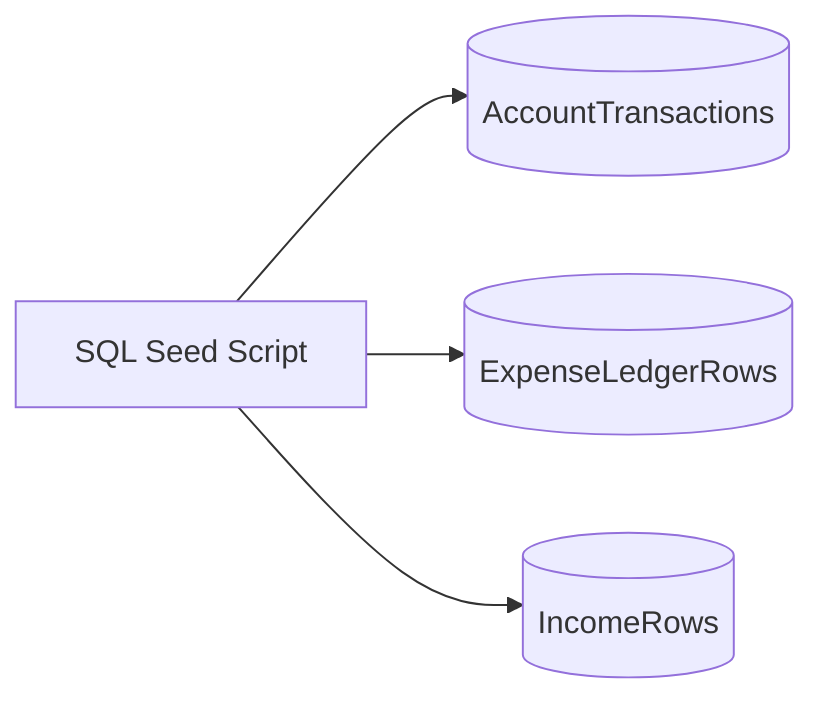

# E2E Data Flow Charts

Generated: 2026-04-11

## 1) Authentication + Authorization Flow

## 2) Admin Module Flow

## 3) Accounts + Ledger Flow

## 4) Inventory -> Material Price Master Flow

## 5) Sales Flow

## 6) Expense Workflow Flow

## 7) Employee Flow

## 8) Quotation + Calculation Snapshot Flow

## 9) Legacy Ledger Tables Seeded for Full-Table Coverage

